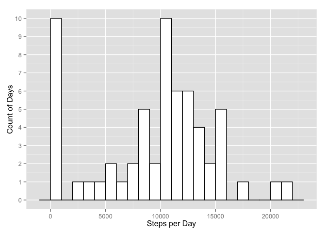

# Reproducible Research Peer Assessment 1
KiloNovember  
April 19, 2015  


# Loading and preprocessing the data

Here's my code for loading the activity.csv file into a data frame.
The data must first be downloaded and unzipped to a file system location
you choose which you will subesequently use for the "filepath" argument to this function.
The data can be found at: 

https://d396qusza40orc.cloudfront.net/repdata%2Fdata%2Factivity.zip

    loadData <- function(filepath){
      activity<-read.csv(filepath)
      activity
    }

```r
  df<- loadData("activity.csv")
```

# What is mean total number of steps taken per day?
    mean.steps <-function(df){
      # Compute mean steps per day, eliminating rows with NA value for steps.
      # Collect total number of steps per day
     spd <- aggregate(df$steps, list(df$date), sum, na.rm=TRUE)
     
      #Compute mean
      mean(spd$x)
    }

##### Mean steps per day


```r
    mean.steps(df)
```

```
## [1] 9354.23
```

    median.steps <-function(df){
      # Compute median steps per day, eliminating rows with NA value for steps
     
      # Collect total number of steps per day
      spd <- aggregate(df$steps, list(df$date), sum, na.rm=TRUE)
      
      #Compute median
      median(spd$x)
    }

##### Median steps per day


```r
    median.steps(df)
```

```
## [1] 10395
```
### A histogram of steps taken per day with a bin-width of 1000 steps

    histo.steps <- function(df){
      agg <- aggregate(df$steps, list(df$date), sum, na.rm=TRUE)
      ggplot(agg, aes(x=x)) + geom_histogram(data=agg$steps, binwidth = 1000, color="black", fill="white") +  scale_y_continuous(breaks=seq(0, 20, 1)) + ylab("Count of Days") + xlab("Steps per Day")
    }


```r
  require("ggplot2", lib.loc="/Library/Frameworks/R.framework/Versions/3.1/Resources/library")
  histo.steps(df)
```

 

# What is the average daily activity pattern?

    ts.plot <- function(df){
      spi <- aggregate(df$steps, list(df$interval), mean, na.rm=TRUE)
      ggplot(spi, aes(x=Group.1, y=x)) + geom_line() + ylab("Steps") + xlab("5-minute Interval") 
    }


```r
  ts.plot(df)
```

 

##### Five-minute interval with the highest average number of steps

    steps.grouped.by.interval <- function(df){
      # Compute the mean number of steps per five-minute interval over the period of the data set
      aggregate(df$steps, list(df$interval), mean, na.rm=TRUE)
    }


```r
    sgbi <- steps.grouped.by.interval(df)
    colnames(sgbi) <- c("Interval", "Mean_Steps")
    sgbi[sgbi$Mean_Steps == max(sgbi$Mean_Steps),]
```

```
##     Interval Mean_Steps
## 104      835   206.1698
```

# Imputing missing values

## Calculate and report the total number of missing values in the dataset

    count.NAs <- function(df){
      length(which(is.na(df)))
    }


```r
  count.NAs(df)
```

```
## [1] 2304
```


## Synthetic data set with NAs replaced by the mean value of identical periods in the days where a value has been recorded

The data for the missing five-minute periods was synthesized by computing the mean values for the corresponding periods 
on those days for which actual step counts are recorded. These mean values were then imputed to the periods for which no 
data was recorded.

    synthesize.missing.data <- function(df){
      incomplete.cases <- subset.NAs(df)
      mean.steps.pi <- mean.steps.per.interval(df)
      
      # Loop through the incomplete cases, and select from the mean.steps
      # data frame the calculated mean value for the matching 5-minute period
      # and assign it to the corresponding NA value
      
      for(i in 1:nrow(incomplete.cases)){
          interval.number <- incomplete.cases[i,3]
          incomplete.cases[i,1] <- mean.steps.pi[mean.steps.pi$Group.1 == interval.number,2]
      }
        
        # The formerly incomplete rows in incomplete.cases now have 
        # been made artifically complete by inserting into the "steps" column, 
        # the value of the average number of steps taken during the 
        # corresponding interval in the days where data was recorded
        
        incomplete.cases
    }


```r
  synth.obs <- synthesize.missing.data(df)
```
### Subset the complete cases for later combination with synthetic cases
    subset.complete.cases <- function(df){
      complete <- subset(df, !is.na(steps))
      complete
    }

```r
  actual.obs <- subset.complete.cases(df)
```
### Create a new dataset that is equal to the original dataset but with the missing data filled in.

    merge.datasets <- function(synth.obs, actual.obs){
      # synth.obs are those rows with the synthesized
      # value for the "steps" column.
      # actual.obs are those rows with recorded values
      
      # for the "steps" column
      
      rbind(synth.obs,actual.obs)
    }


```r
  merged.data <- merge.datasets(synth.obs, actual.obs)
```

### A histogram of steps taken per day with a bin-width of 1000 steps, merged data set

```r
    histo.steps(merged.data)
```

 

### Mean and Median Values for the Merged Data Set

##### Mean


```r
    mean.steps(merged.data)
```

```
## [1] 10766.19
```

##### Median


```r
    median.steps(merged.data)
```

```
## [1] 10766.19
```

##### Effects:
By including the synthesized values, the distribution has been normalized, i.e., the mean and median values are now identical.
The mode falls within the bin of the tallest histogram bar.


# Are there differences in activity patterns between weekdays and weekends?

##### Add a Weekday/Weekend Factor Variable

    add.weekday.factor<- function(df){
      df$weekday <- as.factor(weekdays(as.Date(df$date)) %in% c("Saturday", "Sunday"))
      levels(df$weekday)[levels(df$weekday) == FALSE] <- "Weekend"
      levels(df$weekday)[levels(df$weekday) == TRUE] <- "Weekday"
      df
    }


```r
  weekday.factored.dataframe <- add.weekday.factor(merged.data)
```

##### Comparison of Activity Patterns, Weekends vs. Weekdays 

    weekday.vs.weekend.plot <- function(df){  
      spi <- aggregate(df$steps, list(df$interval, df$weekday), mean, na.rm=TRUE)
      ggplot(spi, aes(x=Group.1, y=x)) + geom_line() + ylab("Steps") + xlab("5-minute Interval") + facet_wrap(~ Group.2)
    }


```r
  weekday.vs.weekend.plot(weekday.factored.dataframe)
```

 
